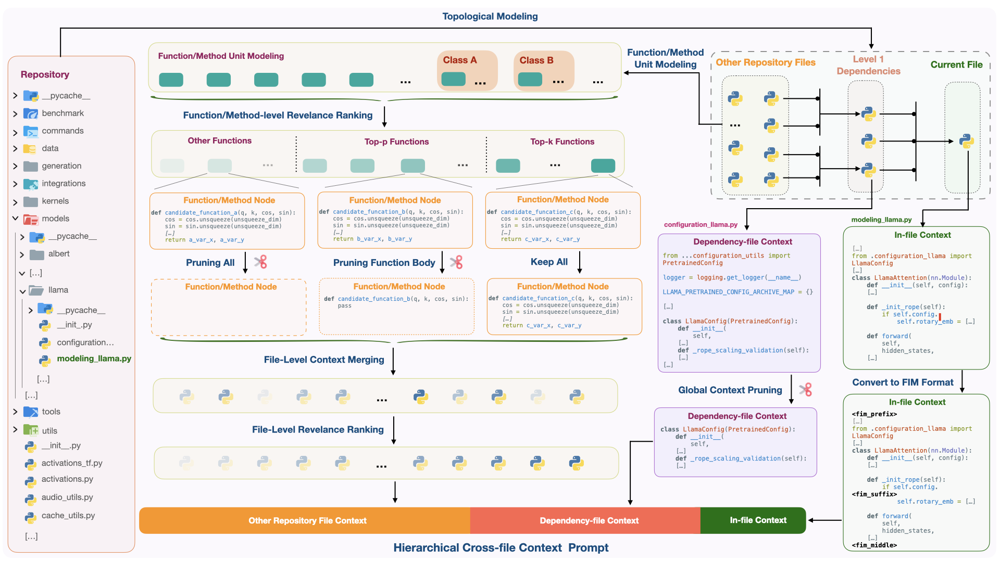

# Hierarchical Context Pruning: Optimizing Real-World Code Completion with Repository-Level Pretrained Code LLMs

<p align="center">
<a href='https://arxiv.org/abs/2406.18294'></a>
</p>





## Requirements

- Run `pip install -r requirements.txt` to install all requirements.

&nbsp;

## Repository Structure

```text
.
├── LICENSE
├── README.md
├── assets
│   └── methedology.png
├── benchmarks
│   ├── crosscodeeval
│   │  ├── data
│   │  ├── raw_data
│   │  ├── real_repos
│   │  └── python_line_completion.jsonl
│   └── repobench
│       ├── raw_data
│       ├── real_repos
│       └── python_line_completion.jsonl
├── complete.py
├── configs
│   ├── __init__.py
│   └── templates.py
├── create_completion_metadata.py
├── entry.py
├── evaluate.py
├── inputs
│   ├── crosscodeeval
│   │   ├── baselines
│   │   │── hcp
│   │   └── preliminary
│   └── repobench
│       ├── baselines
│       │── hcp
|── outputs
│   ├── crosscodeeval
│   │   ├── baselines
│   │   │── hcp
│   │   └── preliminary
│   └── repobench
│       ├── baselines
│       │── hcp
├── requirements.txt
├── scripts
│   ├── generate_cceval_inputs.sh
│   ├── generate_repobench_inputs.sh
│   ├── test_cceval_baselines.sh
│   ├── test_cceval_hcp.sh
│   ├── test_cceval_preliminary.sh
│   ├── test_repobench_baselines.sh
│   └── test_repobench_hcp.sh
├── src
│   ├── build_repo.py
│   ├── codeparser.py
│   ├── node
│   │   ├── __init__.py
│   │   └── modeling_node.py
│   ├── retriever
│   │   ├── __init__.py
│   │   ├── auto.py
│   │   ├── jina.py
│   │   └── openai.py
│   └── topo
│       ├── __init__.py
│       └── modeling_topo.py
└── utils
    ├── preprocess
    │   ├── crosscodeeval.py
    │   ├── repobench.py
    │   └── split_hcp_all.py
    └── statistic
        ├── get_bad_case.py
        ├── get_hit_changes.py
        └── get_prompt_length.py
```

&nbsp;

## Dataset

### CrossCodeEval Dataset
1. Download the original data:

	We have constructed the test set using the original data from [CrossCodeEval](https://crosscodeeval.github.io).
  Due to copyright issues, please contact the [author(s)](https://robin-y-ding-columbia.github.io) of CrossCodeEval to request the original data.
  Once you have the original data, please unzip it and place it in the `benchmarks/crosscodeeval/data` directory.

2. Construct the test set:

	Run `./scripts/generate_cceval_inputs.sh` to generate the test inputs for the CrossCodeEval dataset.

### RepoBench Dataset

Simply run `./scripts/generate_repobench_inputs.sh` to download and generate the test inputs for the RepoBench dataset.

&nbsp;

## Sample Inputs

1. Below is a sample input for the RAG-based methods:

```json
{
    "task_id": "project_cc_python/62",
    "repository": "turboderp-exllama-a544085",
    "file": "example_ws.py",
    "strategy": "rag",
    "groundtruth": "sequence_actual[:, -max_stop_string:])[0]",
    "prefix": "import asyncio\nimport [TRUNCATED]",
    "suffix": "\n    next_token = [TRUNCATED]",
    "context": "# Here are some relevant code fragments from other files of the repo:\n\n# the below code fragment can be found in:\n# alt_generator.py\n#             self.sequence_str += self.held_text\n#       [TRUNCATED]"
}

```

2. Below is a sample input for the HCP method:

```json
{
    "task_id": "project_cc_python/62",
    "repository": "turboderp-exllama-a544085",
    "file": "example_ws.py",
    "strategy": "hcp",
    "groundtruth": "sequence_actual[:, -max_stop_string:])[0]",
    "row": 104,
    "col": 42,
    "d_level": 0,
    "context": {
        "repo_name": "turboderp-exllama-a544085",
        "cross_file_context": {
            "turboderp-exllama-a544085/example_lora.py": "",
            "turboderp-exllama-a544085/example_basic.py": "",
            "turboderp-exllama-a544085/model_init.py": "",
            "turboderp-exllama-a544085/webui/app.py": "",
            "turboderp-exllama-a544085/perplexity.py": "",
            "turboderp-exllama-a544085/globals.py": "",
            "turboderp-exllama-a544085/test_benchmark_inference.py": "",
            "turboderp-exllama-a544085/datasets/download_datasets.py": "",
            "turboderp-exllama-a544085/example_batch.py": "",
            "turboderp-exllama-a544085/example_chatbot.py": "",
            "turboderp-exllama-a544085/example_alt_generator.py": "",
            "turboderp-exllama-a544085/cuda_ext.py": "",
            "turboderp-exllama-a544085/example_cfg.py": "def generate_cfg(prompts, alpha, max_new_tokens):\n\n    [TRUCATED]",
            "turboderp-exllama-a544085/example_flask.py": "@app.route('/infer_precise', methods=['POST'])\ndef inferContextP():\n    [TRUCATED]",
            "turboderp-exllama-a544085/webui/session.py": "class Node:\n\nclass Session:\n\ndef respond(self, author, stop_conditions, total_tokens, res_line = \"\", num_res_tokens = 0):\n   [TRUCATED]",
            "turboderp-exllama-a544085/alt_generator.py": "class ExLlamaAltGenerator:\n\ndef begin_stream(self, prompt: str, stop_conditions: list, [TRUCATED]",
            "turboderp-exllama-a544085/tokenizer.py": "class ExLlamaTokenizer:\n\n    def __init__(self, tokenizer_model_path):\n\n        self.path = tokenizer_model_path\n        [TRUCATED]",
            "turboderp-exllama-a544085/lora.py": "class ExLlamaLora:\n\n    lora_config_path: str\n    lora_path: str\n    lora_r: int\n    lora_alpha: float\n    lora_scaling: float\n    [TRUCATED]",
            "turboderp-exllama-a544085/model.py": "class ParsedEnum(Enum):\n\n    def __str__(self):\n        return self.name.lower()\n\n    def __repr__(self):\n        return str(self) [TRUCATED]"
        },
        "infile_context": {
            "prefix": "import asyncio\nimport websockets\nimport json\nfrom sentencepiece import SentencePieceProcessor\n\n [TRUCATED]",
            "suffix": "\n    next_token = generator.gen_single_token()\n\n    # End on stop token\n\n    if next_token in stop_tokens:\n [TRUCATED]"
        }
    }
}
```

&nbsp;

## Experiments

> [!Note]
We use OpenAI Text Embedding API to embed the code snippets.
You need to set the environment variable `OPENAI_BASE_URL` to your OpenAI API base URL and the environment variable `OPENAI_API_KEY` to your OpenAI API key in `.env` file.

To Reproduce the experiments in the paper, you can run the following scripts:

1. Run `./scripts/test_cceval_baselines.sh` to evaluate the baselines on the CrossCodeEval dataset.
2. Run `./scripts/test_cceval_hcp.sh` to evaluate the HCP method on the CrossCodeEval dataset.
3. Run `./scripts/test_cceval_preliminary.sh` to evaluate the preliminary study on the CrossCodeEval dataset.
4. Run `./scripts/test_repobench_baselines.sh` to evaluate the baselines on the RepoBench dataset.
5. Run `./scripts/test_repobench_hcp.sh` to evaluate the HCP method on the RepoBench dataset.

&nbsp;


## Example

We provide an simple example to run the HCP method to get the cross-file context and infile context:

```bash
python entry.py \
  --repo path/to/a/real/repo \
  --file path/to/current/python/file \
  --row row/number/of/the/fim/hole/in/current/file \
  --col column/number/of/the/fim/hole/in/current/file \
  --top-p 0.3 \
  --top-k 5
```

This script will return the cross-file context and infile context for the given file and position.
The `top-p` and `top-k` are the hyperparameters for the HCP method.
You can use the returned context to implement your own application.

&nbsp;

## Citations

If you find our work useful, please cite us.

```
@misc{zhang2024hierarchicalcontextpruningoptimizing,
      title={Hierarchical Context Pruning: Optimizing Real-World Code Completion with Repository-Level Pretrained Code LLMs}, 
      author={Lei Zhang and Yunshui Li and Jiaming Li and Xiaobo Xia and Jiaxi Yang and Run Luo and Minzheng Wang and Longze Chen and Junhao Liu and Min Yang},
      year={2024},
      eprint={2406.18294},
      archivePrefix={arXiv},
      primaryClass={cs.CL},
      url={https://arxiv.org/abs/2406.18294}, 
}
```
